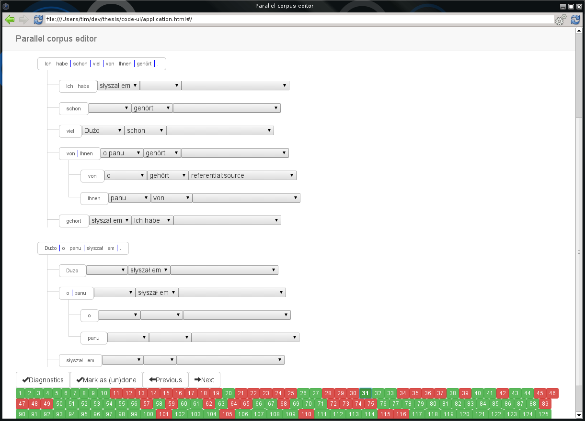

## Ziele der Arbeit
- **Ursprüngliche Idee:** Wissensbasis aus Wikipedia erzeugen
    - Ontologische Darstellung des Wissens
    - Komplementieren mit einer anderen Sprachversion
- Teilprobleme bearbeitet
    - Adpositionen
    - Wissensdarstellungen

\note{
    - Verarbeitung paralleler Korpora schwierig
}

## Thema
### Cross-language information retrieval (CLIR)
1. Disambiguierung von Adpositionen
    - Adpositionen kommen häufig in Sätzen vor
    - mehrdeutig
    - beeinflussen die Semantik
2. Abstraktionen zur Repräsentation von Wissen in parallelen Korpora
    - Tokens
    - Einheiten
    - Abbildungen
    - Abhängigkeiten
    - Annotationen

\note{
    - Disambiguierungsproblem \\
    - für Adpositionen Wissen auf Wortebene repräsentieren \\
    - Adpositionen nur aus Kontext erschließen \\
    - grm. Informationen geben auch Auskunft \\
    - Adpositionen in ihrer Bedeutung überladen
}

## Adpositionen
### Forschungsstand
* bisher nur im Rahmen der kontrastiven Linguistik untersucht
* kein standardisiertes Annotationsschema

### Fokus der Arbeit
* statistische Modelle statt präskriptiver Regeln
* Gesamtmodell bestehend aus zwei Sprachversionen
* Spezifizierung eines Annotationsschemas
* Trainieren von Modellen für Abbildungen und Annotationen

# Wissensrepräsentationen
## Tokens
* abstrahieren Wörter eines Satzes
* morphosyntaktische Informationen

### Bestandteile
ID
  ~ Position im Satz

Wortform
  ~ Konjugierte/deklinierte Form

Lemma
  ~ Grundform des Worts

POS^[*engl.:* part of speech]
  ~ Wortart

Attribute
  ~ Grammatikalische Eigenschaften

## Einheiten
* Folge von Tokens
* angelehnt an semantischen Rollen
    - [Peter]~<span style="font-variant: small-caps">Agent</span>~ hit~<span style="font-variant: small-caps">Cause/Impact</span>~ [the ball]~<span style="font-variant: small-caps">Impactee</span>~.
* Unterschied: bilden Hierarchie
    - erlaubt spezifischere Abbildungen

### Beispiel
[Peter] [sold] [the [book]] [to [Daniel]] [.]

## Einheiten
### Definitionen
* $S$: Satz als Folge von Tokens
* $|S|$: Anzahl der Tokens
* $E$: Menge aller Einheiten in $S$
* Einheit $e \in E$ Menge benachbarter Positionen
* Wurzeleinheit $r = \{1, ..., |S|\} \in E$
* Kindeinheit $child(e)$ echte Teilmenge von $e$
    - $e \in E$ gdw. $e \neq \emptyset$ und $\forall e_1 \in e : \exists e_2 \in e : |e_1 - e_2| = 1$
* $\bigcup_{e \in E} e = r$

## Abbildungen
### Beispiel
[Peter] [hat] [Daniel] [das [Buch]] [verkauft] [.] \
[Peter] [sold] [the [book]] [to [Daniel]] [.]

$A = \{$ ([Peter], [Peter]), ([hat], [sold]), ([verkauft], [sold]), ([Daniel], [Daniel]), ([das], [the]), ([Buch], [book]) $\}$

### Definitionen
* $(e_1, e_2)$: Abbildung mit $e_1 \in S$ Quellsatz und $e_2 \in T$ Zielsatz

> **Abbildungen sind nicht bijektiv** \
> $(x, [to]) \not\in A$ -- Im Deutschen durch ein Attribut im Token [Daniel] repräsentiert^[Kasus: Dativ].

\note{
    engl.: alignment \\
    Relationen zwischen Quell- und Zielsatz \\
    $S$ bzw. $T$ Mengen aller Einheiten des Quell- und Zielsatzes \\
    Beispiel erklären
}

## Abhängigkeiten
### Beispiel
\begin{dependency}[theme = simple, style = white]
   \begin{deptext}[column sep=1em]
      Peter \& verkauft \& Daniel \& das Buch \& . \\
   \end{deptext}
   \depedge{1}{2}{}
   \depedge{3}{2}{}
   \depedge{4}{2}{}
\end{dependency}

\note{
angelehnt an Dependenzstrukturen \\
Begründer: Lucien Tesnière (1893–1954) \\
Verb bestimmt Satzbau \\
dargestellt als Baum \\
Abh. formalisieren Beziehungen zwischen Tokens \\
Verallgemeinerung von Dependenzstrukturen \\
Beziehungen \\
    zwischen Verben und Argumenten \\
    zwischen Nomen und ihren Modifikatoren \\
verwandt: "bubble structures"; http://gerdes.fr/papiers/avant/bubbles.pdf
}

# Annotierung
## Korpora
### Wikipedia
* Großes Korpus
* Freier Text
* Vielzahl an Sprachversionen
    - starke inhaltliche Abweichungen
    - unterschiedliche Formulierungen
    - kein einheitlicher Aufbau
    - selten direkte Übersetzungen

## Korpora
### Untertitel
* OPUS-Korpus^[Siehe [opus.lingfil.uu.se](http://opus.lingfil.uu.se/)] bereitet Untertitel auf
    - Alignment auf Satzbasis
* Kurze Sätze
* Sätze semantisch und lexikalisch ähnlich
* Hohes *signal-to-noise ratio* (SNR)
    * OCR-Fehler
    * Alignment-Fehler
    * etc.
* Einfache Selektion

## Entscheidungen
- **Korpus:** OPUS
    - für Adpositionen geeignet
- **Sprachen:** Deutsch $\rightarrow$ Polnisch
    - Verfügbarkeit an morphosyntaktischen Taggern^[**Deutsch:** RFTagger, **Polnisch:** concraft-pl]
    - Referenzliteratur vorhanden
    - unterschiedliche Sprachfamilien

## Prozess


## Prozess
### Umsetzung
* Bibliotheken und Programme zur Verarbeitung von Korpora
    - Normalisierung von Korpora als hierarchische Struktur
    - Implementierung des Protokolls von Concraft
    - Oberfläche zur Verwaltung von Sätzen
    - Erzeugung von Modellen
* Weka^[Siehe [cs.waikato.ac.nz/ml/weka](http://www.cs.waikato.ac.nz/ml/weka/)] für Modelle

## Annotierung


## Korpusanalyse
|  | **Anzahl**   |
|-----------|--------|
| Sätze  | 220 |
| Einheiten | 2892 |
| Tokens (Deutsch) | 2220 |
| Tokens (Polnisch) | 1911 |
| Abgebildete Einheiten | 1187 |
| Abhängigkeiten | 196 |

# Modelle
## Modell für Abbildungen
- **Eingabe:** alle Abbildungen des Trainingskorpus
    - falsche Abbildungen werden generiert
- **Binäre Klasse:** gültige Abbildung?
- Features ausgewählt unter Berücksichtigung von
    - struktureller Ähnlichkeit: Satzbau, Verschachtelung
    - grammatikalischer Ähnlichkeit
    - lexikalischer Ähnlichkeit
- Insgesamt 11 Features

## Modell für Abbildungen
| **Feature**         | **Anteil** |
|---------------------|------------|
| childrenRatio       | 0,25462    |
| dictCorrespondences | 0,20784    |
| depthDiff           | 0,19325    |
| posSimilarity       | 0,18537    |
| sourceChildren      | 0,15533    |
| targetChildren      | 0,14271    |
| offsetRatio         | 0,04685    |
| lengthRatio         | 0,02428    |
| depthRatio          | 0,00678    |
| orthSimilarity      | 0,00437    |
| lemmaSimilarity     | 0,00242    |

:\  Korrelation zwischen den Features und der Klasse

## Modell für Abbildungen
### Algorithmus
- Bayessches Netz
    - korrekt klassifiziert: 95,72%
    - Sensitivität von 'positiv': 85,3%
- Regellernen (JRip):
    - korrekt klassifiziert: 98,21%
    - Sensitivität von 'positiv': 70,9%
- Entscheidungsbaum (J48^[Wekas Implementierung von C4.5])
    - korrekt klassifiziert: 98,3093%
    - Sensitivität von 'positiv': 69,8%

## Modell für Abbildungen
### Bayessches Netz
:\  Performance des Gesamtmodells

| **Klassifizierung** | **Instanzen** | **Anteil**  |
|---------------------|---------------|-------------|
| richtig             | 31650         | 95,7234%    |
| falsch              | 1414          | 4,2766%     |

:\  Performance der Klassen

| **Klasse**  | **Genauigkeit** | **Sensitivität** |
|---------|-------------|--------------|
| negativ | 99,4%       | 96,1%        |
| positiv | 45%       | 85,3%        |

## Modell für Annotationen
- 24 nominale Klassen
- Attribute ebenfalls nominal
- Features gewählt unter Annahme, dass Klasse abhängt von
    - grammatikalischen Eigenschaften
    - lexikalischem Kontext
- drei Modelle trainiert: `de`, `pl`, `de + pl`

## Modell für Annotationen
### Deutsch
deLemma
  ~ Lemma der Adposition

dePOS
  ~ POS der Adposition

deArgumentPOS
  ~ POS des Arguments

deArgumentCase
  ~ Kasus des Arguments

deDependencyLemma
  ~ Lemma der abhängigen Einheit

deDependencyPOS
  ~ POS der abhängigen Einheit

## Modell für Annotationen
### Polnisch
plLemma
  ~ Lemma der Adposition

plPOS
  ~ POS der Adposition

plCase
  ~ Kasus der Adposition

plArgumentPOS
  ~ POS des Arguments

## Modell für Annotationen
- **J48**
    - zu starkes Pruning
    - geringe Tiefe
    - Klassifikation abhängig von wenigen Features
- **k-Means**
    - Clustering
    - Verfahren nicht für nominale Werte geeignet
    - erkennt für vorliegende Modelle nur zwei Cluster
- **LMT**^[*engl.:* Logistic model tree]
    - Clustering-Ansatz: logistische Regression + Entscheidungsbäume
    - gute Feature-Selektion und -Gruppierung

## Modell für Annotationen
### LMT

:\  Präzision aller Modelle im Vergleich

| **Modell** | **LMT** |
|--------|-----|-----|
| <span style="font-variant: small-caps">adpositions-de</span> | 53,43% |
| <span style="font-variant: small-caps">adpositions-pl</span> | 47,09% |
| <span style="font-variant: small-caps">adpositions-de-pl</span> | 62,43% |

## Modell für Annotationen
### LMT: Beispiel
```
Class 20 :
-11.4 +
[deLemma=mit] * 6.51 +
[deArgumentPOS=Noun] * -3.53 +
[deDependencyLemma=beginnen] * 9.24 +
[plLemma=od] * 7.99
```

## Herausforderungen
### Tagging
* wenige morphologische Tagger/Analyser für Deutsch erhältlich
* RFTagger lässt sich nicht im Server-Modus verwenden
* fehlerhafte Datensätze in RFTaggers Modell
    - falscher Zeichensatz
    - falscher Kasus

### Adpositionen
- gewählter CLIR-Ansatz erfordert:
    - korrekte Übersetzungen
    - vorherige Erstellung von Entity-Abbildungen

## Ergebnisse
* Referenzkorpus erzeugt
* Schema für Annotationen ausgearbeitet
* Entwicklung von Tools zur Verarbeitung
* Adpositionen im Kontext der Mehrsprachigkeit untersucht

## Ausblick
### Prozess
- zeitaufwändiger Annotationsprozess
    - kann größtenteils mit Regeln automatisiert werden
    - UI: on-the-fly Muster lernen und Annotationen vorschlagen
    - Crowd-sourcing
- Inkonsistenzen finden
- Annotationsschema ausweiten
- weitere Sprachen untersuchen
- Google Translate für einsprachige Texte einsetzen

## Ausblick
### Anwendungen
- Adpositionsmodell für Wissensextraktion verwenden
    - Definitionen, Eigenschaften von Gegenständen
    - Beziehungen
